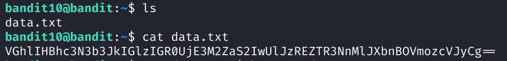

+++
title = "Bandit10 -> Bandit11"
date = 2025-10-10T10:00:00+02:00
author = "mrb0b1073"
draft = false
weight = 14
+++

## Level description
The password for the next level is stored in the file **data.txt**, which contains base64 encoded data.

## Tips for beginners
- Search what is base64 encoding.
- Learn different tools to encode and decode data using base64.

## Solution
This level introduces the idea of encoding data. 

When we talk about encoding data, we mean transforming information from one format into another so that it can be properly stored, transmitted, or interpreted by systems that may not understand its original form. It is important to point that encoding does not encrypt or hide the data, it simply represents it in a different way. 

For example, when sending binary data (like an image or a password hash) through systems that only support text — such as email, HTTP headers, or JSON — we need a way to represent those bytes safely using readable characters. 

Base64 is one of the most common encoding schemes used today. It converts binary data into a string made up of 64 characters (A–Z, a–z, 0–9, +, and /). It is used in web development, APIs, emails, cryptography, etc.

In simple terms, it works as follows:
1. The input data (binary or text) is split into chunks of 3 bytes (24 bits).
2. Each 24-bit chunk is divided into 4 groups of 6 bits.
3. Each group is represented by one character from the Base64 alphabet.
4. If the data doesn’t divide evenly, padding (=) is added at the end.

Checking the file content we can see the padding:



It can be solved in several ways. For example:
1. Using the bash command `base64` with `-d` flag.
2. Using an online base64 decoder.
3. Creating your own script.

The simplest way is to use the following:

```bash
cat data.txt | base64 -d 
```

> **NB:** Try to save the output in a file and encode back the content using `base64`.

You will get the password for [bandit12]().