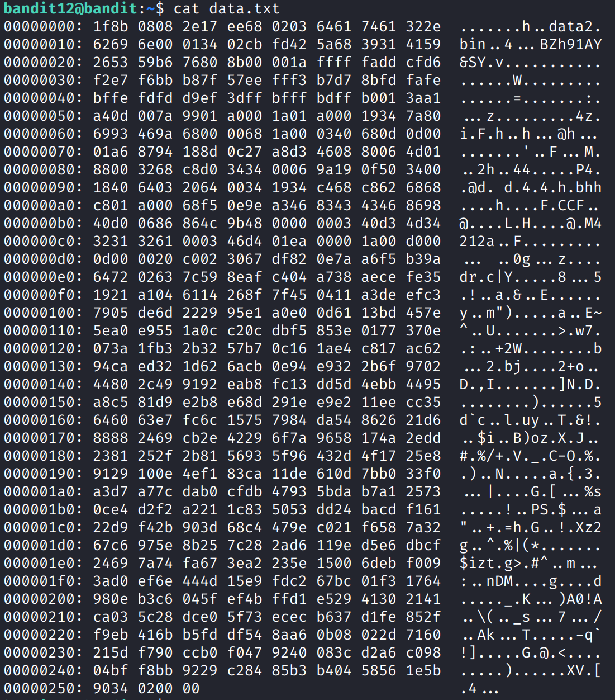

+++
title = "Bandit12 -> Bandit13"
date = 2025-11-01T10:00:00+02:00
author = "mrb0b1073"
draft = false
weight = 16
+++

## Level description
The password for the next level is stored in the file **data.txt**, which is a hexdump of a file that has been repeatedly compressed. For this level it may be useful to create a directory under /tmp in which you can work. Use mkdir with a hard to guess directory name. Or better, use the command `mktemp -d`. Then copy the datafile using cp, and rename it using mv (read the manpages!)

## Tips for beginners
- Understand what compression is and why it is used.
- If you have issues read the manpages.
- Be patient 😅.

## Solution
File compression topic is coming!

You may be familiar with compression, zipping files is a common task. But before starting with the solution, we know the **data.txt** is a **hexdump**. What is this?

If you examine contents:



A hexdump is a representation of binary data in hexadecimal format, often used to inspect the raw contents of a file. Each byte is shown as a two-digit hex value, making it easier to analyze or debug files at a low level. In Linux, you can create one with hexdump or xxd, and you can reverse it (rebuild the original file) using:

```bash
xxd -r data.txt > data
```

But first, let's be tidy and kind with other people, we don't want to leave trash in home directory. Create a temp directory, copy the data.txt file into it and move to the directory:

```bash
mktemp -d 
cp data.txt <path_to_dir>
mv <path_to_dir>
```

Now you can reverse the hexdump and you will get something which is gzip compressed file (remember the use of `file` command).

A little bit of theory first. *File compression* is a process used to reduce the size of files so they take up less storage space or can be transferred more efficiently. It works by encoding data in a way that removes redundancy while allowing the original content to be restored when decompressed. Compression is widely used for archiving, backups, and data transmission. There are two main types:
- **lossless compression**: It preserves all original data (used in ZIP, GZIP, or TAR files).
- **lossy compression**: It sacrifices some detail for smaller sizes. This is common in images, audio, and video formats like JPG or MP3.

So you want to decompress file using for example `gunzip`:
```bash
mv data data2.gz
gunzip data2.gz
```

> **NB:** You may be asking why we are renaming the file to `data2.gz`. If you try to run `gunzip` over **data**, you get an error complaining about unknown suffix. As we know the file is gzip (thanks to `file`) we specify it in name to avoid tool be confused.

What did we get? A **data2** file which is bzip2 compressed data. Same process, this time with `bunzip2`:

```bash
bunzip2 data2
```

And you get **data2.out** which is again gzip (I know, this is so funny...). Repeat the process and you get **data4**, a POSIX tar file.

Just decompress the tar:
```bash
tar -xf data4
```

From this point, you will have to repeat the process. Every file is gzip, bzip2 or tar, so you know how to decompress. At the end, you will get **data8** which FINALLY is ASCII and you can read the password. 

Next level is bandit14 (in progress).